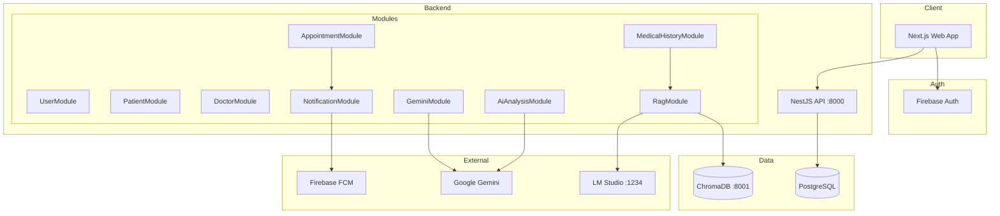

# Architecture — EG-healthcare

## High-Level Diagram



---

## Monorepo (Turbo)

- **`apps/api`** — NestJS REST API  
- **`apps/web`** — Next.js App Router  
- **`packages/types`** — Shared TypeScript types  

---

## Database (TypeORM + PostgreSQL)

> The project uses **TypeORM**, not Prisma. Tables are auto-synced in development (`synchronize: true`).

### Core Entities

| Entity | Primary Key | Relations |
|--------|-------------|-----------|
| `User` | `userID` (= Firebase uid) | — |
| `Patient` | `patientID` (= patient uid) | `appointments[]` |
| `Doctor` | `doctorID` (= doctor uid) | `appointments[]` |
| `Appointment` | `appointmentID` (auto) | `doctor`, `patient` |
| `MedicalHistory` | `id` (UUID) | `patient` (CASCADE delete) |

### MedicalHistory

```typescript
// apps/api/src/medical-history/entities/medical-history.entity.ts
id: UUID
patientID: string          // FK → Patient
content: text              // Full medical report text
type: diagnosis | prescription | lab_report | ...
title, summary, visitDate, doctorName, doctorID
metadata: JSON
isActive: boolean          // soft delete
createdAt, updatedAt
@@Index(['patientID', 'createdAt'])
```

---

## Authentication & Roles

1. **Frontend:** Firebase Authentication (Email/Password, Google)  
2. **Backend:** JWT guards are not enabled on most endpoints yet (commented out in `medical-history.controller.ts`)  
3. **Role:** Stored in PostgreSQL (`User.role`) + `localStorage` (`user_role_{uid}`)  
4. **AppContext** fetches the role from `GET /users/:uid` after `onAuthStateChanged`

---

## User Registration Flow

```
Register Page
  → Firebase createUser
  → POST /users        { userID, username, email, role }
  → POST /patients     (if patient)  { patientID: uid, ... }
  → POST /doctors      (if doctor)   { doctorID: uid, ... }
  → router.push('/dashboard')
```

---

## Appointment Booking Flow

```
BookingModal
  → POST /appointments
       { patientID, doctorID, date, time, type, status }
  → AppointmentService.create()
       ├── validate doctor exists
       ├── validate patient exists  ← 404 if no patient record
       └── NotificationService → FCM to doctor
```

---

## RAG Agent System

### Adding a Record

```
POST /medical-history
  → Save to PostgreSQL
  → RagService.addData() → ChromaDB (metadata: patientID, recordId, ...)
```

### Doctor Query

```
POST /medical-history/chat
  { patientID, question, limit? }
  → similaritySearch(question, limit, { patientID })
  → answerWithContext(question, context)
  → { answer, contextSources }
```

### Prompt (Hallucination Prevention)

The LLM is constrained to answer from retrieved records only; if no relevant information exists, it returns:

> "No information is available in the patient's medical record regarding this."

---

## Frontend Structure

```
apps/web/
├── app/
│   ├── page.tsx              # Landing
│   ├── signin/ register/
│   └── (main)/               # Protected layout
│       ├── dashboard/
│       ├── appointments/
│       ├── Doctors/
│       ├── Patients/
│       ├── chat/
│       ├── ai-analysis/
│       └── diagnosis-history/
├── context/AppContext.tsx    # Auth, role, appointments
├── hooks/                    # React Query hooks
├── api/                      # Axios API clients
└── components/               # UI + domain components
```

**State:** React Query (server state) + AppContext (auth, role, appointments cache).

---

## Backend Modules

| Module | Route | Responsibility |
|--------|-------|----------------|
| UserModule | `/users` | Accounts + FCM token |
| PatientModule | `/patients` | Patient CRUD |
| DoctorModule | `/doctors` | Doctor CRUD |
| AppointmentModule | `/appointments` | Appointments + doctor's patient list |
| MedicalHistoryModule | `/medical-history` | Records + RAG chat |
| RagModule | `/rag` | feed / ask (legacy) |
| GeminiModule | `/ai/chat` | General chat |
| AiAnalysisModule | `/ai-analysis/xray` | X-ray analysis |
| NotificationModule | — | FCM (internal) |
